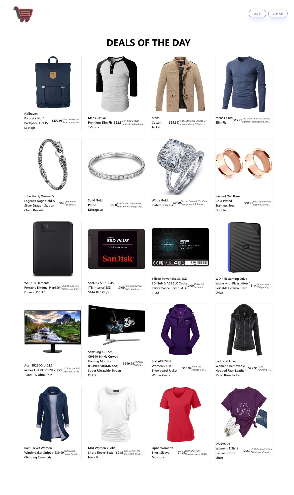

# I-Short

## Short Description

I-Short is a visual representation of an online store implemented using TypeScript, Tailwind CSS, React, PostCSS, ESLint, Headless UI, Heroicons and interacting with Fake Store API. This project is built on Next.js to ensure efficient and progressive development.

## Detailed project description

The project consists of the following key directories:

- **.next**: contains files created by Next.js during the project build process.
- **app**: the main application directory with components, pages and other files.
- **components**: contains components used in the application.
- **public**: contains static files such as images and icons.
- **node_modules**: stores project dependencies installed using npm.

The root directory also contains configuration and settings files such as `.eslintrc.json`, `next.config.js`, `postcss.config.js`, `tailwind.config.ts` and others.

## List of technologies used

- TypeScript
- Tailwind CSS
- React
- PostCSS
- ESLint
- Headless UI
- Heroicons
- Fake Store API
- CSS
- Next.js

## Site functionality, it's purpose

I-Short provides a visual display of an online store with the ability to browse and purchase products. It interacts with the Fake Store API to load product information. The user can view product details, add to cart, and view product reviews.

## Preview

